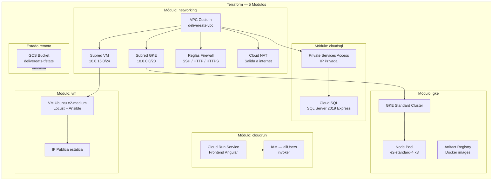
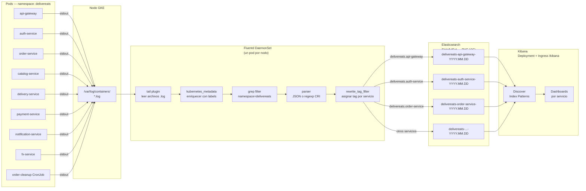
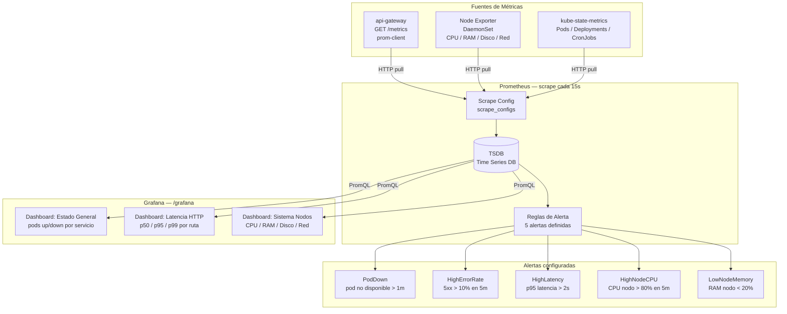
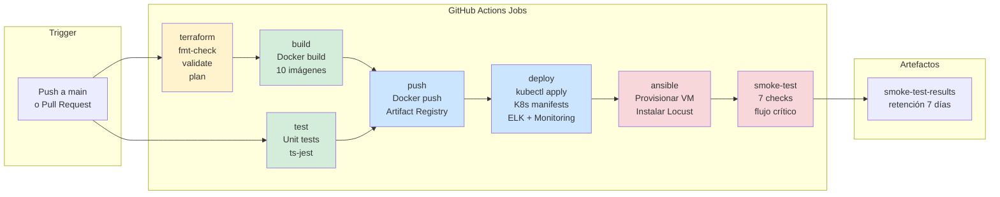
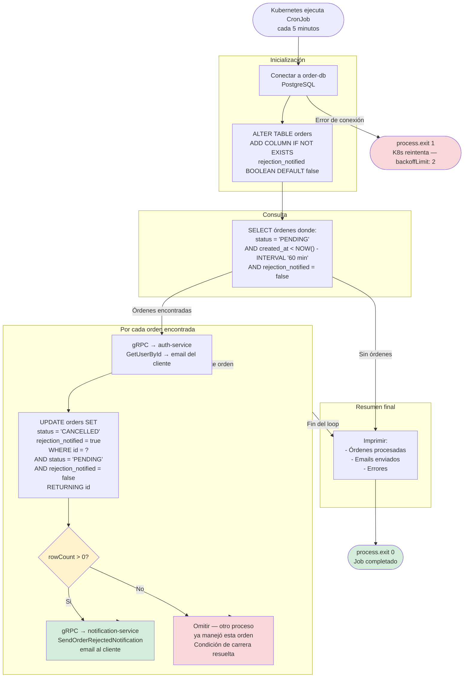
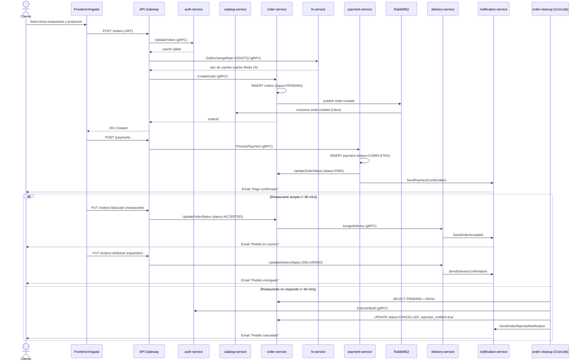

# DeliverEats — Diagramas de Arquitectura

**Universidad de San Carlos de Guatemala**
**Curso: Software Avanzado — 2026**
**Carnet: 201114493**

---

## Tabla de Contenidos

1. [Arquitectura General del Sistema](#1-arquitectura-general-del-sistema)
2. [Infraestructura en GCP — Terraform](#2-infraestructura-en-gcp--terraform)
3. [Stack de Observabilidad — ELK](#3-stack-de-observabilidad--elk)
4. [Stack de Observabilidad — Prometheus y Grafana](#4-stack-de-observabilidad--prometheus-y-grafana)
5. [Pipeline CI/CD](#5-pipeline-cicd)
6. [CronJob — Rechazo Automático de Órdenes](#6-cronjob--rechazo-automático-de-órdenes)
7. [Flujo de una Orden (End-to-End)](#7-flujo-de-una-orden-end-to-end)

---

## 1. Arquitectura General del Sistema

Visión completa del sistema: frontend, API Gateway, microservicios, bases de datos, colas y herramientas de observabilidad desplegados en GKE.

```mermaid
graph TB
    subgraph Internet
        USER[Cliente Web]
        ADMIN[Admin Web]
        REST[Restaurante Web]
    end

    subgraph GCP["GCP — Google Cloud Platform"]
        subgraph CloudRun["Cloud Run"]
            FRONTEND[Frontend Angular :4200]
        end

        subgraph GKE["GKE Cluster — namespace: delivereats"]
            INGRESS[Ingress NGINX]

            subgraph Gateway["API Gateway :3000"]
                GW[REST → gRPC\n/metrics]
            end

            subgraph Services["Microservicios"]
                AUTH[auth-service :50052]
                CATALOG[catalog-service :50051]
                ORDER[order-service :50053]
                DELIVERY[delivery-service :50054]
                PAYMENT[payment-service :50057]
                FX[fx-service :50056]
                NOTIF[notification-service :50055]
            end

            subgraph Databases["Bases de Datos — StatefulSets"]
                AUTH_DB[(auth-db\nPostgreSQL :5432)]
                CATALOG_DB[(catalog-db\nPostgreSQL :5433)]
                ORDER_DB[(order-db\nPostgreSQL :5434)]
                DELIVERY_DB[(delivery-db\nPostgreSQL :5435)]
                PAYMENT_DB[(payment-db\nPostgreSQL :5436)]
                REDIS[(Redis :6379)]
            end

            subgraph Messaging["Mensajeria"]
                RABBIT[RabbitMQ]
            end

            subgraph Automation["Automatizacion"]
                CRONJOB[order-cleanup\nCronJob cada 5 min]
            end

            subgraph Observability["Observabilidad — namespace: logging / monitoring"]
                ES[Elasticsearch]
                KIBANA[Kibana /kibana]
                FLUENTD[Fluentd DaemonSet]
                PROM[Prometheus]
                GRAFANA[Grafana /grafana]
                NODE_EXP[Node Exporter\nDaemonSet]
                KSM[kube-state-metrics]
            end
        end

        subgraph CloudSQL["Cloud SQL"]
            SQLSERVER[(SQL Server 2019\nIP Privada)]
        end
    end

    USER --> FRONTEND
    ADMIN --> FRONTEND
    REST --> FRONTEND
    FRONTEND --> INGRESS
    INGRESS --> GW
    GW -->|gRPC| AUTH
    GW -->|gRPC| CATALOG
    GW -->|gRPC| ORDER
    GW -->|gRPC| DELIVERY
    GW -->|gRPC| PAYMENT
    GW -->|gRPC| FX

    AUTH --> AUTH_DB
    CATALOG --> CATALOG_DB
    ORDER --> ORDER_DB
    DELIVERY --> DELIVERY_DB
    PAYMENT --> PAYMENT_DB
    FX --> REDIS

    ORDER -->|publish| RABBIT
    CATALOG -->|consume| RABBIT

    PAYMENT --> NOTIF
    DELIVERY --> NOTIF
    CRONJOB --> ORDER_DB
    CRONJOB -->|gRPC| AUTH
    CRONJOB -->|gRPC| NOTIF

    FLUENTD -->|tail logs| ES
    ES --> KIBANA
    GW -->|/metrics| PROM
    NODE_EXP --> PROM
    KSM --> PROM
    PROM --> GRAFANA
```

---

## 2. Infraestructura en GCP — Terraform

Recursos aprovisionados por cada módulo de Terraform y sus dependencias.

---

## 3. Stack de Observabilidad — ELK

Flujo completo desde la generación de logs en los pods hasta su visualización en Kibana.

---

## 4. Stack de Observabilidad — Prometheus y Grafana

Recoleccion de metricas desde los servicios, nodos y estado del cluster, con alertas y dashboards.

---

## 5. Pipeline CI/CD

Flujo completo del pipeline de GitHub Actions con sus 7 jobs y dependencias.

---

## 6. CronJob — Rechazo Automático de Órdenes

Logica del `order-cleanup` con mecanismo anti-spam y manejo de condiciones de carrera.

---

## 7. Flujo de una Orden (End-to-End)

Secuencia completa desde que el cliente hace un pedido hasta la entrega o rechazo.

---

*DeliverEats — Software Avanzado 2026 — Carnet 201114493*
